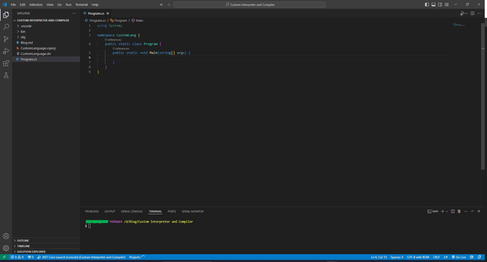

# Guide to Build Your own Programming Language Interpreter with C#

Building a programming language is not as hard as it seems. It's just a lot splitting strings and keeping track of variables and tokens. I hope by the end of this article, you'll have an understanding on how it works. If you would like to view the [**GitHub Repository**](https:github.com), and contribute to the language, please do. 

- [Guide to Build Your own Programming Language Interpreter with C#](#guide-to-build-your-own-programming-language-interpreter-with-c)
- [Planning](#planning)
- [Interpreter](#interpreter)
  - [Lexer](#lexer)
  - [Parser](#parser)
  - [Executor](#executor)
    - [Functions](#functions)
    - [Variables](#variables)
    - [Operations](#operations)
- [Testing](#testing)
- [Adding Functions](#adding-functions)
- [Recap](#recap)


I've been really loving building my own programming language, [EZCode](https://github.com/EZCodeLanguage/EZCode). It has been getting complicated lately so I wanted to take a break and desscribe the process of making a programming language. I don't feel like coming up with a name, so the language we are going to make is going to be called **CustomLang** or **CLang** for short. It will be extremely simple and have only a few features,
- Variable Declaration
- Operations
- Printing to the Console

I will be making it in C# because this is the language I feel most comfortable with. I will make an interpreter for this language and not a compiler just to make it simple.



# Planning

Let's plan out what we want CLang to look like syntacticly. I'm going to go with something like Python. This is what I want it to look like,

```cs
var x = 10
var y = 20
var z = ($x$ * $y$)
print "Equation: $x$ * $y$ = $z$"

// outputs
// Equation: 10 * 20 = 200
```

We'll use `$` syntax to show there is a variable. The only function we'll have is `print`. We won't use parenthesis for the function either. 

Now That we have plan for out language, we'll start making the interpreter!

# Interpreter

There are 3 main steps of an interpreter, 
- [Lexer](#lexer): The lexer converts the code into tokens that can be more easily read by the prgram.
- [Parser](#parser): The parser takes the tokens from the lexer and makes an Abstract Syntax Tree, or an AST. This will give a heirarchy to the code to tell the interpreter what needs to be computed first.
- [Executor](#executor): This will execute the program line by line 

## Lexer

The first step of the parser is to split the code into many lines. We'll start by creating a few classes, 

```csharp
// Lexer.cs
namespace CustomLang 
{
    public class LexerToken 
    {
        public string Value { get; set; }
        public TokenType Type { get; set; }
        public enum TokenType
        {
            Identifier, Reserved, Symbol, Variable, Number, String
        }
        public LexerToken(string value, TokenType type)
        {
            Value = value;
            Type = type;
        }
    }
    public class LexerLine 
    {
        public int Number { get; set; }
        public LexerToken[] Tokens { get; set; }
        public LexerLine(int number, LexerToken[] tokens) 
        {
            Number = number;
            Tokens = tokens;
        }
    }
}
```

Now that we have defined a token and a line, we can create a `Tokenizer` method. It will take the code `string` as an input and output `Line[]`. 
```csharp
// lexer.cs
public class Lexer 
{
    public LexerLine[] Tokenizer(string code) 
    {
        // Next Steps in Here
    }
}
```
We'll Split `code` into a `line[]` by each new line character `\n` and trim the whitespaces for each line.
```csharp
string[] lines = code.Split('\n').Select(x => x.Trim() ).ToArray();
```
Next We'll loop through each line. We'll go through each character in the line and determine how it should be added to a token.
```csharp
string[] lines = code.Split('\n').Select(x => x.Trim() ).ToArray();
LexerLine[] lexerLines = [];

for (int i = 0; i < lines.Length; i++)
{
    char[] chars = lines[i].ToCharArray();
    LexerToken[] tokens = [];

    for (int j = 0; j < chars.Length; j++)
    {

    }


    lexerLines = [.. lexerLines, new(i, tokens)];
}

return lexerLines;
```
We got the structure down. Now, we got to implement the Tokenization part.

Lets add some functions to check what the current character is.
```csharp
internal static bool isWhiteSpace(char c)
{
    return string.IsNullOrWhiteSpace(c.ToString());
}
internal static bool isNum(char c)
{
    return int.TryParse(c.ToString(), out _);
}
internal static bool isSymbol(char c)
{
    return (new[] { '=', '+', '-', '*', '/', '$', '"', ',' }).Any(x => x == c);
}
internal static bool isAlpha(char c)
{
    return !isNum(c) && !isWhiteSpace(c) && !isSymbol(c);
}
```

The Final Lexer code is a bit long to show, but here is the link to the file in the GitHub Repo, https://github.com. I'll explain it though. First it checks if the character is a whitespace, number, symbol, or letter. It will add the character to the correct variable depending on what type the character is. When it reaches the end of the token (ie, a space or operator for a number or quotation mark for a string), it will add it to the array.

I've added some code to convert it to JSON format, 
```csharp
Lexer.Line[] lines = Lexer.Tokenizer("""
    var x = 10
    var y = 20
    var z = ($x$ * $y$)
    print "Equation: $x$ * $y$ = $z$"
    """);
Console.WriteLine(JsonConvert.SerializeObject(lines, Formatting.Indented));
```
I'll just show the output for the `var x = 10`,
```json
[
  {
    "Number": 1,
    "Tokens": [
      {
        "Value": "var",
        "Type": 1 // Reserved
      },
      {
        "Value": "x",
        "Type": 0 // Identifier
      },
      {
        "Value": "=",
        "Type": 2 // Symbol
      },
      {
        "Value": "10",
        "Type": 4 // Number
      }
    ]
  },
]
```

## Parser

The Parser is the next step of the interpreter. This creates an abstract syntax tree adding heirarchy to the code. There are multiple ways to do this. I will not implement this in our language because of how simple CLang is. If you want to implement this, here is what it might look like. For the example `var z = ($x$ * $y$)`, the tree might be look like this,
```
// z = (x * y)

// AST Tree:
//
//        z
//       / \
//      z   *
//         / \
//        x   y
```

## Executor

The last part of the interpreter is the execution part. It will go line by line and read/execute the tokens in it. Here is a simple skeleton of the code without any implementation added.

```csharp
// Execution.cs

using static CustomLang.Lexer;

namespace CustomLang
{
    public class Execution
    {
        public static int Execute(Line[] lines)
        {
            int number_line = 0,
                error_code = 0;
            try
            {
                foreach (Line line in lines)
                {
                    number_line = line.Number;
                    Token token = line.Tokens[0]; // first token in line
                    switch (token.Type)
                    {
                        case TokenType.Identifier: // functions or already declared variables
                            break;
                        case TokenType.Reserved: // 'var' keyword 
                            break;
                        case TokenType.Symbol:
                        case TokenType.Variable:
                        case TokenType.Number:
                        case TokenType.String:
                            throw new Exception("Expects first token to be identifier or keyword");
                    }
                }
            }
            catch (Exception e)
            {
                Console.WriteLine(e.Message + $". In line '{number_line}'");
                error_code = 1;
            }
            return error_code;
        }
    }
}

```

### Functions

We'll start with the print function. I'll create a Function class and a print class that inherits from it.

```csharp
// Functions.cs

namespace CustomLang 
{
    public abstract class Function 
    {
        public string Name { get; set; }
        public int Params { get; set; }
        public abstract void Execute(object[] args);
    }
    public class Print : Function 
    {
        public Print()
        {
            Name = "print";
            Params = 1;
        }
        public override void Execute(object[] args)
        {
            string text = string.Join("", args.Select(x => x.ToString()));
            Console.WriteLine(text);
        }
    }
}
```

Doing this will easily allow more functions to be added to the language.

We will need to add this static array to the beginning of the `Execution.cs` file to keep track of all of the built-in functions that we can make,
```csharp
public static Function[] Functions = 
[
    new Print()
];
```

Now, to implement this in the Executor, we'll need to check to see if the first token is an identifier, and if it's value is the same as the function's name. If it is, we'll need to extract the parameters from the rest of the line. Last but not least, execute the function. Here is how it will look in code,
```cs
// inside the token switch in Execution.cs

case TokenType.Identifier:
    if (Functions.FirstOrDefault(x => x.Name == token.Value) is Function func)
    {
        object[] parameters = new object[func.Params];
        int params_count = 0;
        for (int i = 1; i < line.Tokens.Length; i++)
        {
            if (line.Tokens[i].Type == TokenType.Symbol && line.Tokens[i].Value == ",")
            {
                params_count++;
                continue;
            }

            parameters[params_count] += line.Tokens[i].Value;
        }
        func.Execute(parameters);
    }
break;
```

The way we have implemented this allows multiple functions to be added very easily.

To make sure it works, we'll run this code

```cs
// Program.cs

namespace CustomLang 
{
    public static class Program
    {
        public static void Main(string[] args) 
        {
            Lexer.Line[] lines = Lexer.Tokenizer("""
                var x = 10
                var y = 20
                var z = ($x$ * $y$)
                print "Equation: $x$ * $y$ = $z$"
                """);
            Execution.Execute(lines);
        }
    }
}
```

It successfully outputs,

```
Equation: x * y = z
```

### Variables

This is the most important part of our language. We'll first define a variable with it's own class.

```cs
// Variable.cs

namespace CustomLang
{
    public class Variable
    {
        public string Name { get; set; }
        public object? Value { get; set; }
        public Variable(string name, object? value)
        {
            Name = name;
            Value = value;
        }
    }
}
```

Now we need to implement this in the `Execution.cs`. First, we need to check if the syntax is correct. If it is, we get the value and name from tokens. Lastly, the program needs to add the variable to a list of all variables. Let's implement this.

```cs
// inside the token switch in Execution.cs

case TokenType.Reserved:
    if (token.Value == "var")
    {
        if (line.Tokens.Length < 4)
        {
            throw new Exception("Variable declaration is incorrect. Correct syntax is, 'var NAME = VALUE'");
        }
        if (line.Tokens[2].Value != "=")
        {
            throw new Exception("Variable declaration is incorrect. Correct syntax is, 'var NAME = VALUE'");
        }
        string name = line.Tokens[1].Value;
        object? value = GetValueFromTokens(line.Tokens.Skip(3).ToArray());

        Variable var = new Variable(name, value);

        Variables = Variables.Append(var).ToArray();
    }
    else
    {
        throw new Exception($"Error in tokenization, '{token.Value}' is not a reserved keyword");
    }
    break;
```

And we need to add the Variable List to the beginning of the Execute Function.

```cs
    public static int Execute(Line[] lines)
    {
        Variable[] Variables = [];

        // Rest of code...
    }
```

We got it mapped out now, but we still need to get the value from the tokens. I created this method, `GetValueFromTokens`, but haven't defined it yet. Let's get started on that.

```cs
// Execution.cs

public static object? GetValueFromTokens(Token[] tokens, Variable[] variables)
{
    object? value = null; 

    if (tokens[0].Type == TokenType.Symbol)
    {
        if (tokens[0].Value == "(")
        {
            // return equation as float value
        }
    }
    else if (tokens[0].Type == TokenType.String)
    {
        // parse and return string
    }
    else if (tokens[0].Type == TokenType.Number)
    {
        // return number as string
    }
    else if (tokens[0].Type == TokenType.Variable)
    {
        // return the variable's value
    }
    else
    {
        throw new Exception("Cannot set variable to unkown type '" + tokens[0].Value + "'");
    }
    return value;
}
```

The method was too long to fit in this. If you want to check how it's done, go to the [GitHub Repo](https://github.com). With this, I also had to modify the [Function](#functions) code in the Execute method.

```cs
Token[][] parameterTokens = new Token[func.Params][];
int paramsCount = 0;
for (int i = 1; i < line.Tokens.Length; i++)
{
    if (line.Tokens[i].Type == TokenType.Symbol && line.Tokens[i].Value == ",")
    {
        paramsCount++;
        continue;
    }

    if (parameterTokens[paramsCount] == null)
        parameterTokens[paramsCount] = [line.Tokens[i]];
    else
        parameterTokens[paramsCount] = [.. parameterTokens[paramsCount], line.Tokens[i]];
}
object[] parameters = new object[func.Params];
for (int i = 0; i < parameterTokens.Length; i++)
{
    parameters[i] = GetValueFromTokens(parameterTokens[i], variables);
    if (parameters[i] == null)
        throw new Exception($"Could not extract value from function parameter '{i + 1}'");
}
func.Execute(parameters);
```

I had to include the `GetValueFromTokens` method so it could extract variables.

The [example code](#planning) we created when we planned it now works! It outputs,
```
Equation: 10 * 20 = 200
```

### Operations

The last thing we need to add to our interpreter are operations the variables can make. Because of the way we set up out lexer, we'll just use `+` instead of `+=` to add to variables. We could go back and adjust the lexer to view `+=` as a single symbol, but honestly just doing `x + 5` will add some uniqueness to *CLang*. We'll start off by adding an `else` statement to the Identifier case in the `Execute` method.

```cs
case TokenType.Identifier:
    if (Functions.FirstOrDefault(x => x.Name == token.Value) is Function func)
    {
        // Execute method
    }
    else
    {
        if (variables.FirstOrDefault(x => x.Name == token.Value) is Variable var)
        {
            // Operate on a variable
        }
        else
        {
            throw new Exception($"'{token.Value}' is not defined in this context");
        }
    }
break;
```

Great! Last thing to just make it work. What thing we'll do is make sure the syntax is correct.
```cs
if (line.Tokens.Length < 3)
    throw new Exception("Variable operation syntax is incorrect. Correct syntax is, 'NAME = VALUE' where '=' can be any operator");
if (line.Tokens[1].Type != TokenType.Symbol)
    throw new Exception("Variable operation syntax is incorrect. Correct syntax is, 'NAME = VALUE' where '=' can be any operator");
```

Next, we'll get the value on the side of the operator. That's very simple with the `GetValueFromTokens` method.

```cs
object value = GetValueFromTokens(line.Tokens.Skip(2).ToArray(), variables);
```

Amazing. we're so close. We jsut got to check if the what operator and do the corresponding operation with it. We also got to make check if the types, `string` and `float`, don't match. For example, we can't add `"Hello"` to the number `10`. Now, let's code it!

```cs
switch(line.Tokens[1].Value)
{
    case "=":
        var.Value = value;
        break;
    case "+":
        if (float.TryParse(var.Value.ToString(), out float varValue) && float.TryParse(value.ToString(), out float setValue))
            var.Value = varValue + setValue;
        if (float.TryParse(var.Value.ToString(), out varValue))
            throw new Exception("Can not add type string to number");
        else
            var.Value = var.Value.ToString() + value.ToString();
        break;
    case "-":
        if (float.TryParse(var.Value.ToString(), out varValue) && float.TryParse(value.ToString(), out setValue))
            var.Value = varValue - setValue;
        else
            throw new Exception("Can not subtract from a variable with type string");
        break;
    case "*":
        if (float.TryParse(var.Value.ToString(), out varValue) && float.TryParse(value.ToString(), out setValue))
            var.Value = varValue * setValue;
        else
            throw new Exception("Can not multiply to a variable with type string");
        break;
    case "/":
        if (float.TryParse(var.Value.ToString(), out varValue) && float.TryParse(value.ToString(), out setValue))
            var.Value = varValue / setValue;
        else
            throw new Exception("Can not divide a variable with type string");
        break;
    default: throw new Exception("Expects a correct operator, '=', '+', '-', '*', or '/'");
}
```

# Testing

Before we say it's done, we got to test it. I have this codem and we can start testing!
```cs
namespace CustomLang 
{
    public static class Program
    {
        public static void Main(string[] args) 
        {
            Lexer.Line[] lines = Lexer.Tokenizer("""
                var x = 10
                var y = 20

                x + "150"

                var z = ($x$ * $y$)

                print "Equation: $x$ * $y$ = $z$"
                """);
            Execution.Execute(lines);
        }
    }
}
```

The output is an error.
```
Can not add type string to number. In line '4'
```

This is correct! Let's try out some other scenarios.

```cs
var Number = (528 - 5)
Number * (999 - 88 + (33 / 3))

var Text = "CLang is awesome"
Text + "!"

print "Text: $Text$, Number: $Number$"
```

And it successfully outputs
```
Text: CLang is awesome!, Number: 482206
```

After doing a quick check, it did the math right!


# Adding Functions

The way we set up the Functions class, we can easily add more functions. If we want to go even further, we can set it up to make set a variable to whatever the function returns. Just for proof of concept, let's add one more function.

```cs
// Function.cs

public class ParseAdd : Function
{
    public ParseAdd()
    {
        Name = "parseAdd";
        Params = 2;
    }
    public override void Execute(object[] args)
    {
        float text = float.Parse(args[0].ToString());
        float add = float.Parse(args[1].ToString());

        float result = text + add;

        Console.WriteLine(result);
    }
}
```

```cs
// Execution.cs

public static Function[] Functions = [
    new Print(),
    new ParseAdd()
    ];
```

This works Great! I ran the code,
```cs
parserAdd "25", 150
```

And it correctly outputted `175`. 

# Recap

I hope this showed how easy it is to make a programming language. I did this with only around *~450* lines of code. There is so much that can be added to this language. The next step would be to do something like this, 
```cs
var x = some_function "parameter"
```
I'm going to stop here, but if any of you want to take this any further, head onto the GitHub Repo and make a pull request. It's so easy to add to this language. Thanks for reading this and if you want an overview of this process without any code, you can read my article, https://a